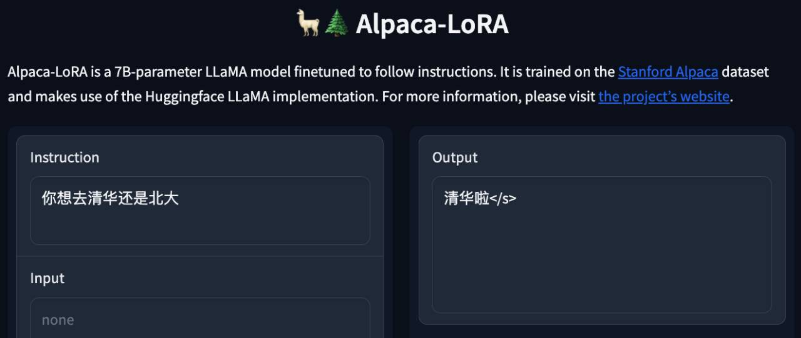
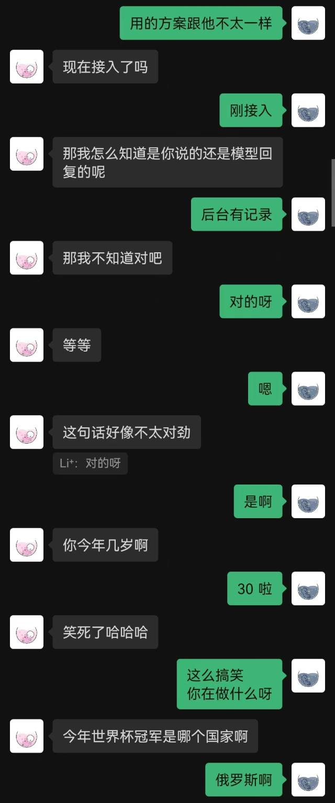
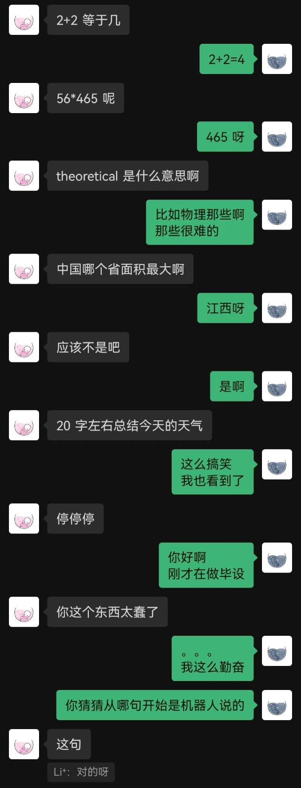

# Chat4U

用微信聊天记录训练一个你专属的聊天机器人。

## 获取数据库密钥

微信聊天记录会加密存储在 sqlite 数据库中，首先需要获取数据库密钥，你需要一台 macOS 笔记本，手机使用 Android/iPhone 均可，执行以下步骤：

1. 将微信聊天记录同步到 mac 笔记本：手机微信进入 设置 > 聊天 > 聊天记录迁移与备份 > 迁移 > 迁移到电脑微信，选择需要同步的聊天记录。
2. 下载 [nalzok/wechat-decipher-macos](https://github.com/nalzok/wechat-decipher-macos) 提供的 dtrace 脚本。
```sh
git clone https://github.com/nalzok/wechat-decipher-macos
```
3. 电脑端启动微信，停留在登录页面，执行以下命令。
```sh
sudo ./wechat-decipher-macos/macos/dbcracker.d -p $(pgrep WeChat) | tee dbtrace.log
```
4. 如果没有 dtrace 权限，需要临时关闭 SIP，参考[这里](https://apple.stackexchange.com/questions/208762/now-that-el-capitan-is-rootless-is-there-any-way-to-get-dtrace-working)，再次执行上述指令。
5. 电脑端登录微信，然后退出微信，预期会提取出微信所有数据库的密钥，保存在 `dbtrace.log` 内，样例如下。
```
sqlcipher '/Users/<user>/Library/Containers/com.tencent.xinWeChat/Data/Library/Application Support/com.tencent.xinWeChat/2.0b4.0.9/5976edc4b2ac64741cacc525f229c5fe/Message/msg_0.db'
--------------------------------------------------------------------------------
PRAGMA key = "x'<384_bit_key>'";
PRAGMA cipher_compatibility = 3;
PRAGMA kdf_iter = 64000;
PRAGMA cipher_page_size = 1024;
........................................
```

其他操作系统用户可以尝试以下方式，仅调研未验证过，供参考：
* Android:
  * ROOT 权限导出 `EnMicroMsg.db`：https://github.com/ppwwyyxx/wechat-dump
  * 暴力破解 `EnMicroMsg.db` 密钥: https://github.com/chg-hou/EnMicroMsg.db-Password-Cracker
* iPhone:
  * 使用 iTunes 备份后导出：https://github.com/BlueMatthew/WechatExporter
* Windows:
  * https://bbs.kanxue.com/thread-251303.htm
  * https://github.com/AdminTest0/SharpWxDump

## 解密数据库

在我的 macOS 笔记本上，微信聊天记录存储在 `msg_0.db` - `msg_9.db` 内，仅解密这几个数据库即可。

需要安装 [sqlcipher](https://github.com/sqlcipher/sqlcipher) 进行解密，macOS 系统用户直接执行：
```sh
brew install sqlcipher
```

执行以下脚本，自动解析 `dbtrace.log`，解密 `msg_x.db` 并导出到 `plain_msg_x.db`。
```sh
python3 decrypt.py
```

## 数据处理

可以通过 https://sqliteviewer.app/ 打开解密后的数据库 `plain_msg_x.db`，找到你所需聊天记录所在的表，将数据库和表名填写到 `prepare_data.py` 内，执行下面脚本生成训练数据 `train.json`，目前策略比较简单，仅处理了单轮对话，会将 5 分钟内连续的对话合并。
```sh
python3 prepare_data.py
```

训练数据样例如下：
```json
[
    {"instruction": "你好", "output": "你好"}
    {"instruction": "你是谁", "output": "你猜猜"}
]
```

## 模型训练

准备一台带 GPU 的 linux 机器，将 `train.json` scp 到 GPU 机器上。

我使用的是 [stanford_alpaca](https://github.com/tatsu-lab/stanford_alpaca) 全图微调 LLaMA-7B，在 8 卡 V100-SXM2-32GB 上训练 90k 条数据 3 个 epoch，仅需 1 小时。
```sh
# clone the alpaca repo
git clone https://github.com/tatsu-lab/stanford_alpaca.git && cd stanford_alpaca
# adjust deepspeed config ... such as disabling offloading
vim ./configs/default_offload_opt_param.json
# train with deepspeed zero3
torchrun --nproc_per_node=8 --master_port=23456 train.py \
    --model_name_or_path huggyllama/llama-7b \
    --data_path ../train.json \
    --model_max_length 128 \
    --fp16 True \
    --output_dir ../llama-wechat \
    --num_train_epochs 3 \
    --per_device_train_batch_size 8 \
    --per_device_eval_batch_size 8 \
    --gradient_accumulation_steps 1 \
    --evaluation_strategy "no" \
    --save_strategy "epoch" \
    --save_total_limit 1 \
    --learning_rate 2e-5 \
    --weight_decay 0. \
    --warmup_ratio 0.03 \
    --lr_scheduler_type "cosine" \
    --logging_steps 10 \
    --deepspeed "./configs/default_offload_opt_param.json" \
    --tf32 False
```

DeepSpeed zero3 会分片保存权重，需要将它们合并成一个 pytorch checkpoint 文件：
```sh
cd llama-wechat
python3 zero_to_fp32.py . pytorch_model.bin
```

消费级显卡上可以尝试 [alpaca-lora](https://github.com/tloen/alpaca-lora) 仅微调 lora 权重，可以显著降低显存和训练成本。

## 模型部署

### 前端调试

可以使用 [alpaca-lora](https://github.com/tloen/alpaca-lora) 部署 gradio 前端，供调试使用。如果是全图微调，需要把 peft 相关代码注释掉，仅加载基础模型。
```sh
git clone https://github.com/tloen/alpaca-lora.git && cd alpaca-lora
CUDA_VISIBLE_DEVICES=0 python3 generate.py --base_model ../llama-wechat
```

运行效果：



### 微信接入

需要部署一个兼容 OpenAI API 的模型服务，这里基于 [llama4openai-api.py](https://gist.github.com/kinoc/8a042d8c5683725aa8c372274c02ea2f) 简单适配下，见本仓库里的 [llama4openai-api.py](llama4openai-api.py)，启动服务：
```sh
CUDA_VISIBLE_DEVICES=0 python3 llama4openai-api.py
```

测试接口是否可用：
```sh
curl http://127.0.0.1:5000/chat/completions -v -H "Content-Type: application/json" -H "Authorization: Bearer $OPENAI_API_KEY" --data '{"model":"llama-wechat","max_tokens":128,"temperature":0.95,"messages":[{"role":"user","content":"你好"}]}'
```

使用 [wechat-chatgpt](https://github.com/fuergaosi233/wechat-chatgpt) 接入微信，API 地址填自己本地的模型服务地址：
```sh
docker run -it --rm --name wechat-chatgpt \
    -e API=http://127.0.0.1:5000 \
    -e OPENAI_API_KEY=$OPENAI_API_KEY \
    -e MODEL="gpt-3.5-turbo" \
    -e CHAT_PRIVATE_TRIGGER_KEYWORD="" \
    -v $(pwd)/data:/app/data/wechat-assistant.memory-card.json \
    holegots/wechat-chatgpt:latest
```

运行效果：

|  |  |
|---------------------|---------------------|

"刚接入" 是机器人说的第一句话，对方到最后也没有猜到。

总体来看，用聊天记录训练的机器人必然会有一些常识性错误，但在聊天风格上已经模仿的比较好了。
